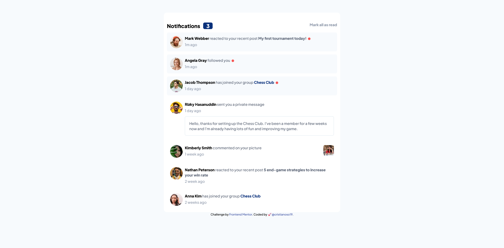
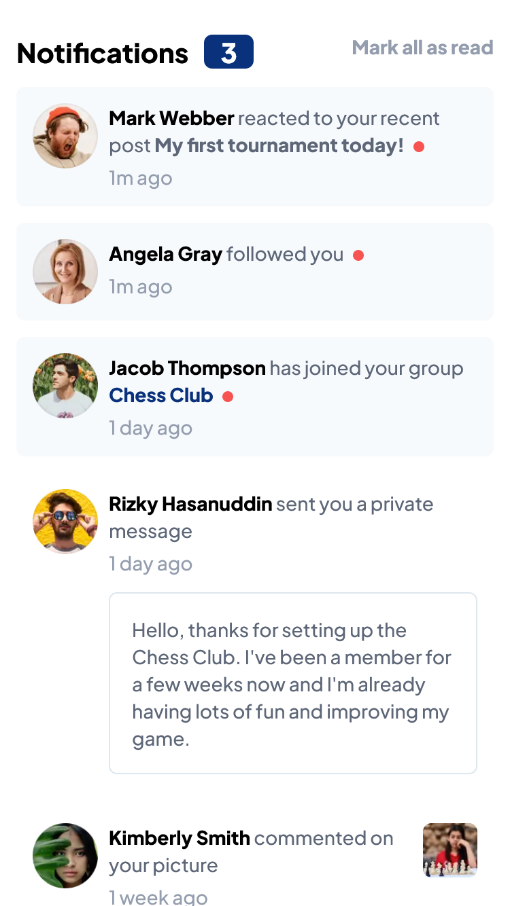

# Frontend Mentor - Notifications page solution

This is a solution to the [Notifications page challenge on Frontend Mentor](https://www.frontendmentor.io/challenges/notifications-page-DqK5QAmKbC). Frontend Mentor challenges help you improve your coding skills by building realistic projects. 

## Table of contents

- [Overview](#overview)
  - [The challenge](#the-challenge)
  - [Screenshot](#screenshot)
  - [Links](#links)
- [My process](#my-process)
  - [Built with](#built-with)
  - [What I learned](#what-i-learned)
- [Author](#author)
- [Acknowledgments](#acknowledgments)


## Overview

### The challenge

Users should be able to:

- Distinguish between "unread" and "read" notifications
- Select "Mark all as read" to toggle the visual state of the unread notifications and set the number of unread messages to zero
- View the optimal layout for the interface depending on their device's screen size
- See hover and focus states for all interactive elements on the page

### Screenshot

#### 🖥️ Desktop view

#### 📱Mobile view



### Links

- Solution URL: [GitHub](https://github.com/cristianoso19/fm.NotificationsPage)
- Live Site URL: [See on vercel.com](https://fmnotificationspage.vercel.app/)

## My process

### Built with

- Semantic HTML5 markup
- TailwindCss
- Flexbox
- Mobile-first workflow

### What I learned

I practice js concepts, tailwindcss, npm, purgecss, and practice some flexbox concepts.
I learn animations such as ping class, that is part of tailwind css

Cards implementation

```html
  <div id="notification-card-1" class="mt-3 bg-verylightgb rounded-md flex justify-between p-3 ">
    
    <div id="notification-card-details" class="ml-2 text-sm flex-auto">
      <a href="#" class="font-bold hover:text-blue">Mark Webber</a>
      <span class="text-darkgb">reacted to your recent post</span>
      <a href="#" class="font-bold text-darkgb cursor-pointer hover:text-blue">My first tournament today!</a>
      <span id="notification-ping">
        <span class="absolute inline-block rounded-full mt-2 ml-1 p-1 bg-red"> </span>
        <span class="relative inline-block animate-ping rounded-full ml-1 p-1 bg-red"> </span>
      </span>
      <p class="text-gb mt-1">1m ago</p>
    </div>
  </div>
```

## Author

- Website - [cristianoso19.com](https://www.cristianoso19.com)
- Frontend Mentor - [@cristianoso19](https://www.frontendmentor.io/profile/cristianoso19)
- Twitter - [@cristianoso19](https://www.twitter.com/cristianoso19)


## Acknowledgments

Thanks to my wife Jenny, i 💖 you.
